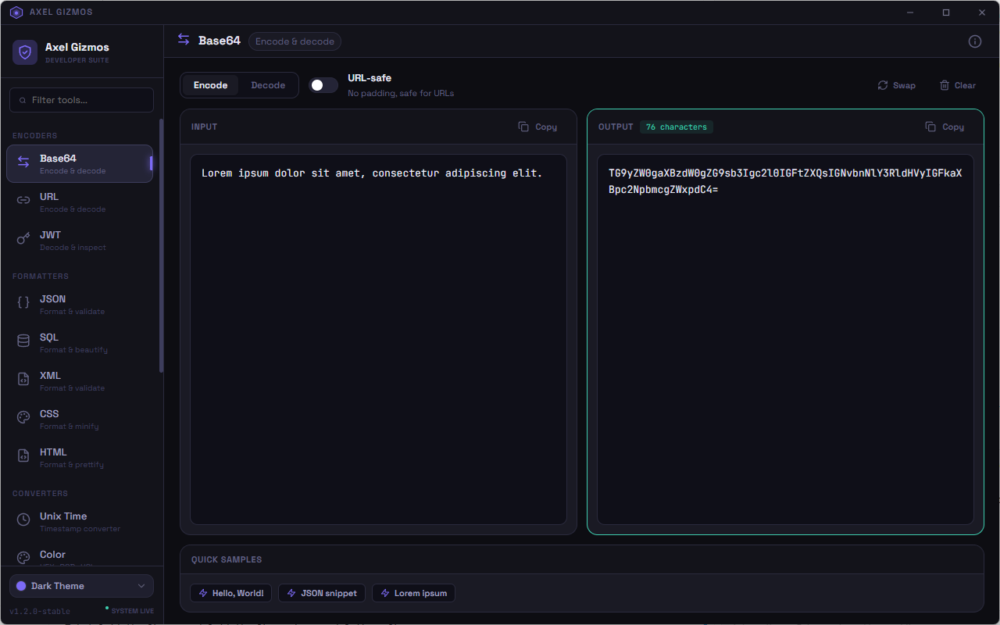
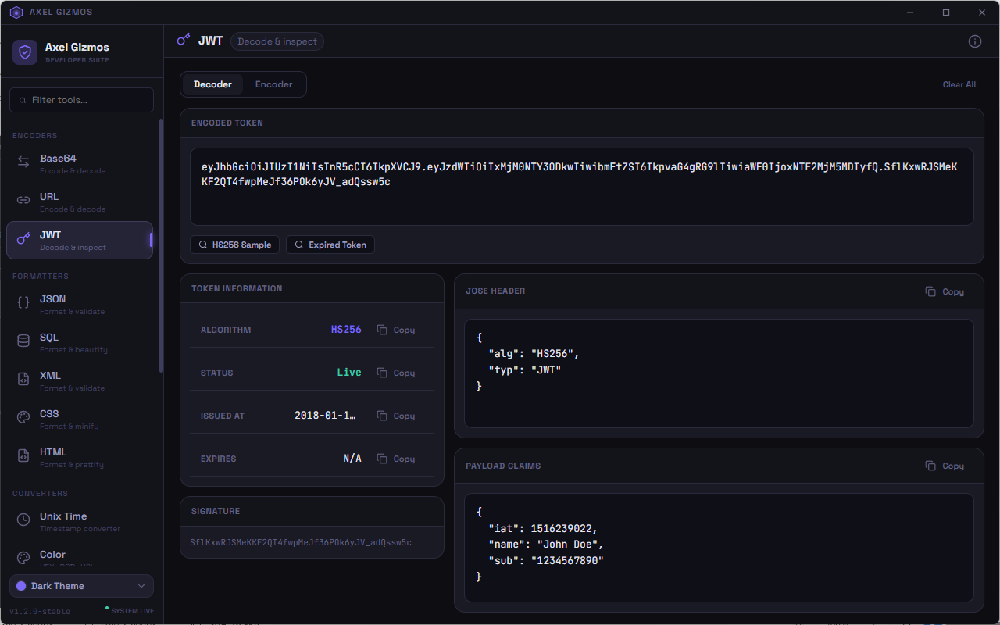
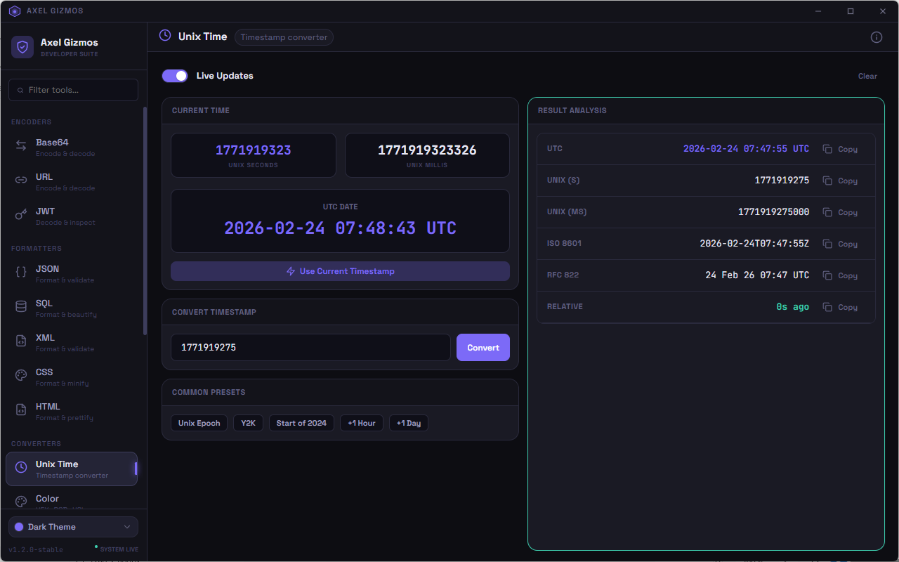

# AxelGizmos

A professional-grade developer toolkit built for speed, privacy, and precision. Available as both a lightweight **web app** and a native **desktop application**.

[**Try the Web App**](https://ehippo.github.io/gizmos/) · [**Download Desktop Releases**](https://github.com/ehippo/gizmos/releases)

---

## The Modern Developer Suite

AxelGizmos provides a clean, high-performance interface for your daily technical tasks. Designed to be accessible everywhere, it balances the portability of the web with the power of a desktop app.

- **Client-Side Logic**: All processing is handled directly in your browser or local app instance. Your data never touches a server.
- **Privacy First**: No telemetry, no cloud syncing, no data leakage. Precise tools for sensitive keys, logs, and internal data.
- **Universal Access**: Use the [web version](https://ehippo.github.io/gizmos/) for quick tasks or install the **Wails-powered** desktop app for a native experience.
- **Premium Aesthetics**: Choose from curated themes like Midnight, Mocha, and Solarized to match your workspace.

---

## Technical Capabilities

### 🔐 Encoders & Security
- **Base64**: Robust encoding/decoding with URL-safe support.
- **URL**: Precision handling of special characters and complex query strings.
- **JWT Debugger**: Header and payload breakdown with expiration validation.
- **Hash**: Support for MD5, SHA families, and HMAC computations.
- **Password Generator**: High-entropy generation with configurable complexity.

### 🛠️ Formatters
- **JSON**: Logic-aware formatting with syntax validation and minification.
- **SQL**: Clause-based formatting with indentation and keyword capitalization.
- **XML / HTML**: Clean structure restoration for nested markup.
- **CSS**: Minification and beautification for modern stylesheets.

### 🔢 Converters & Math
- **Unix Time**: Bi-directional human-time conversion with relative offsets.
- **Color**: Advanced conversion between HEX, RGB, HSL, and RGBA with a visual palette.
- **Number Base**: Seamless switching between Decimal, Hexadecimal, Binary, and Octal.

### 📝 Development Utilities
- **Regex Tester**: Real-time expression testing with match highlights and group capture.
- **UUID**: Version 4 generation with bulk processing support.
- **Cron**: Visual expression builder with next-run scheduling previews.
- **Diff**: Side-by-side comparison with granular character highlighting.
- **Text Utils**: Comprehensive suite for sorting, deduplication, and case transformation.

---

## Interface

### Base64 encoder/decoder


| JWT encoder/decoder | Timestamp converter |
| :---: | :---: |
|  |  |

---

## Technology Stack

- **Frontend**: React 19, Lucide Icons, Vanilla CSS.
- **Desktop Wrapper**: [Wails v2](https://wails.io/) (Go runtime).
- **Logic**: 100% JavaScript (runs client-side for both Web and Desktop).

---

## Getting Started (Local Development)

### Prerequisites
- Go 1.25+
- Node.js 24+
- Wails CLI v2

### Installation
```bash
# Clone
git clone https://github.com/ehippo/gizmos.git
cd gizmos

# Install Dependencies
cd frontend && npm install
```

### Run and Build
```bash
# Web Development
cd frontend && npm run dev

# Desktop Development
wails dev

# Production Desktop Build
wails build
```

---

## Contribution

AxelGizmos is built for developers. We welcome new tools and performance optimizations.

1.  Logic should be implemented within the React components in `frontend/src/tools/`.
2.  Register your new tool in `frontend/src/App.jsx`.
3.  Ensure your tool follows the `BaseTool` pattern for consistent UI/UX.

---

## License

This project is licensed under the MIT License. See the [LICENSE](LICENSE) file for details.
